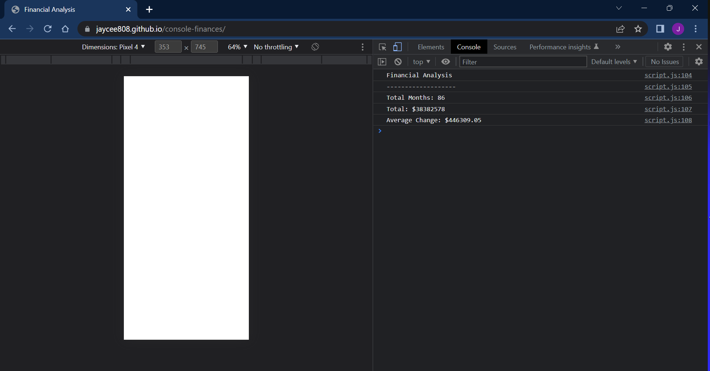

# Unit 4 Challenge: Console Finances

## Overview
 
This repository calculates the profits from a dataset. The code analysis the total profit made and the average change each month.

## Screenshot

  

## Link to deployed site

https://jaycee808.github.io/console-finances/